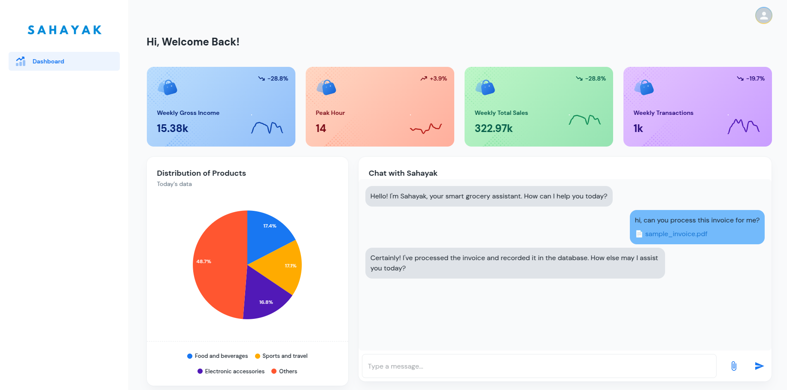

# Sahayak: Your Grocery Store AI Assistant

Sahayak is an AI-powered chatbot designed to assist grocery store owners with sales analysis, invoice processing, and customer insights. The project includes a React frontend and a FastAPI backend.

## Project Structure
```
.
├── ui/                # Frontend (React)
│   ├── src/
│   ├── public/
│   ├── .env.example  # Sample environment variables for frontend
│   └── package.json
│
├── backend/           # Backend (FastAPI)
│   ├── app/
│   ├── models/
│   ├── .env.example  # Sample environment variables for backend
│   └── main.py
│
|── environment.yml     # Conda environment file
└── README.md           # Project documentation
```

## Prerequisites
Ensure you have the following installed:
- [Anaconda](https://www.anaconda.com/) or [Miniconda](https://docs.conda.io/en/latest/miniconda.html)

## Setup Instructions

### 1. Clone the Repository (Optional)
If you haven't already cloned the project, do so using:
```bash
git clone https://github.com/vaishviverma/sahayak.git
cd sahayak
```

### 2. Create a Conda Environment
Create the Conda environment using the provided environment.yml file:
```bash
conda env create -f environment.yml
```

### 3. Activate the Environment
```bash
conda activate my_env  # Replace with the environment name from environment.yml
```
### 4. Set Up Environment Variables

Copy the example environment files and configure them:

```bash
cp ui/.env.example ui/.env
```

```bash
cp backend/.env.example backend/.env
```

Edit backend/.env file as needed with your GOOGLE API KEY (I used Gemini-15-Flash).

### 4. Start the project
- **Frontend (React UI):** http://localhost:3039
- **Backend (FastAPI API):** http://localhost:8000
  
Start the Backend (FastAPI):
```bash
cd backend
uvicorn main:app --reload --host 0.0.0.0 --port 8000
```
Start the Frontend (React):
```bash
cd ui
npm install
npm run dev
```

### 5. Deactivating the Environment (Optional)
When you're done, deactivate the Conda environment:
```bash
conda deactivate
```

## Features
### Sahayak AI Chatbot
- You can ask it to process any invoice - if you don't have, please use backend/sample_invoice.pdf. It processes the invoice and updates the inventory.
- Ask about sales forecast, or how to expand your store.

### Analytics Widget
- Summarizes the Weekly Gross Income, Total Sales, and Transactions.
- Also tells the peak hour - when most number of products were bought.
- Note: The data was collected from [Kaggle Supermarket Sales Dataset](https://www.kaggle.com/datasets/aungpyaeap/supermarket-sales)

I am attaching a screenshot of the web-application.

